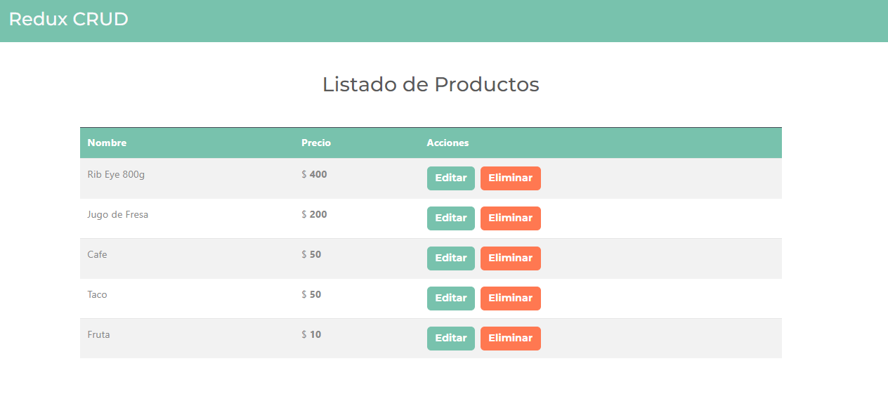

# Redux CRUD

This project is made with Vite and Redux

## Demo

[https://redux-crud-eme-hache.vercel.app/](https://redux-crud-eme-hache.vercel.app/)

## Local Development

To use this project locally, you'll need to set up a local development environment with `json-server`. Follow these steps:

1. Install `json-server` globally (if not installed):

   ```bash
   npm install -g json-server
   ```
2. To run backend use `server` command
3. To run frontend use `dev` command

## Screenshots

<div align="center">
  
  
  
  
</div>
